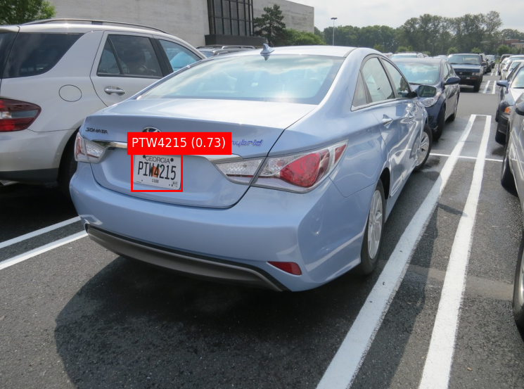
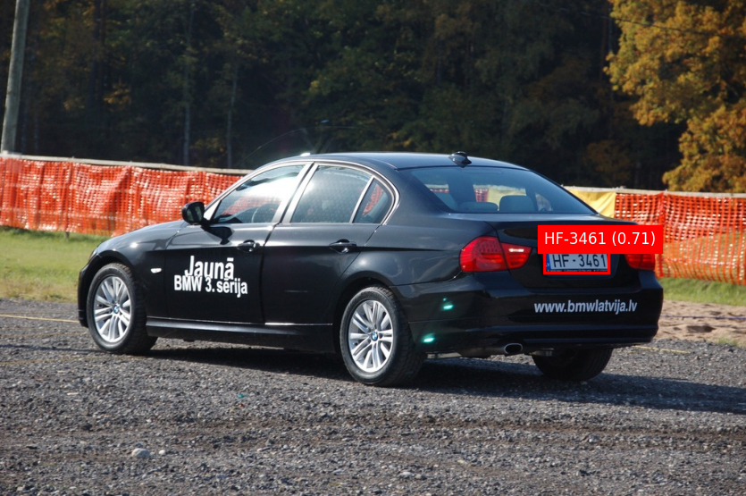

# License Plate Recognition

A computer vision project that detects and reads license plates from images and video using a custom YOLOv8 detection model and OCR.

## Overview

This project implements a two-stage pipeline for license plate recognition:
1. **License Plate Detection**: A custom-trained YOLOv8n model that locates license plates in images
2. **License Plate Reading**: OCR processing to read the text from the detected plates

## Features

- Custom-trained YOLOv8n model using transfer learning
- Accurate license plate detection across various conditions
- Text recognition from detected license plates
- Support for both image and video processing
- Containerized deployment using Docker

## Project Structure

```
licenseplate_recognition/
├── src/
│   ├── detector/        # License plate detection model
│   │   └── model.ipynb  # Training notebook for YOLOv8 detector
│   └── reader/          # OCR for reading license plates
│       └── model.ipynb  # Implementation of OCR and complete pipeline
├── docker-compose.yml   # Standard Docker compose file
├── docker-compose.gpu.yml  # GPU-enabled Docker compose for training
└── Dockerfile           # Container definition
```

## Installation

### Prerequisites

- Docker and Docker Compose
- NVIDIA GPU with appropriate drivers (for training)

```bash
# Clone the repository
git clone https://github.com/yourusername/licenseplate-recognition.git
cd licenseplate-recognition
```

## Usage

### Running with Docker

For general usage (inference):
```bash
docker compose up
```

For training with GPU acceleration:
```bash
docker compose -f docker-compose.yml -f docker-compose.gpu.yml up
```

### Using the Jupyter Notebooks

The project is primarily demonstrated through Jupyter notebooks:

1. **License Plate Recognition Pipeline**: Navigate to `src/reader/model.ipynb` to run the complete pipeline that detects and reads license plates.

2. **YOLOv8 Model Training**: Navigate to `src/detector/model.ipynb` to see how the license plate detection model was trained using transfer learning.

Both notebooks are self-contained with examples and instructions on how to process images and interpret results.

## Methodology

### License Plate Detection Model

The license plate detection model was created through transfer learning using YOLOv8n as the base architecture. The model was trained on a custom dataset of license plates to achieve high accuracy in detecting license plates in various scenarios including different lighting conditions, angles, and distances.

### OCR for License Plate Reading

After detecting the license plate in an image, the region is cropped and processed using an OCR model from Hugging Face specifically designed for reading license plates. This two-stage approach ensures accuracy in both the detection and reading phases.

## Results

Below are some examples of the license plate recognition system in action:

[//]: # (Add screenshots or GIFs of your results here)




## Acknowledgments

- [Ultralytics](https://github.com/ultralytics/ultralytics) for the YOLOv8 implementation
- [Hugging Face](https://huggingface.co/) for the OCR model used in the license plate reading phase

## License

This project is licensed under the MIT License – see the [LICENSE](./LICENSE) file for details.

## Note on the OCR Model

The OCR model used in this project is sourced from Hugging Face. When using models from Hugging Face, it's important to respect their license terms. Most models on Hugging Face come with specific licenses that allow for public use and redistribution as long as proper attribution is given. In this project, I've acknowledged the use of the OCR model and linked to the source.

## Contact

For any questions or suggestions, please open an issue on this repository.
